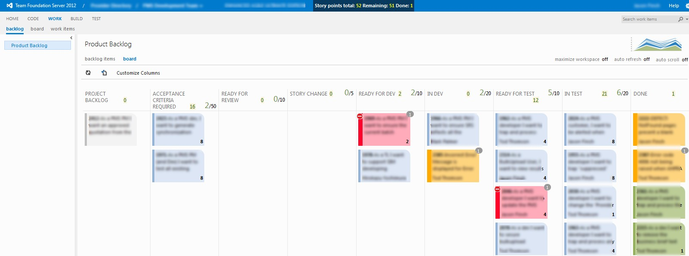

tfs-kanban-greasemonkey
=======================

This is a hacked up greasemonkey script for TFS2012 Web Kanban to enable colour coding cards by tag name.
It also adds some story points total to the header bar by using the Effort value. (We use effort value for story points)

